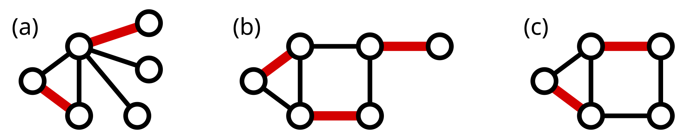

# Genetic-algorithm
Генетический алгоритм решения задачи поиска наибольшего паросочетания

## Задача: 
Найти в заданном графе наибольшее паросочетание – набор ребер, ни у каких двух из которых нет общих вершин.

## Инфо
Наибольшее паросочетание (или максимальное по размеру паросочетание)— это такое паросочетание,
которое содержит максимальное количество рёбер. Число паросочетания v(G) графа G — это число рёбер в наибольшем паросочетании. 
У графа может быть множество наибольших паросочетаний. При этом любое наибольшее паросочетание является максимальным, 
но не любое максимальное будет наибольшим. Следующие три рисунка показывают наибольшие паросочетания в тех же трёх графах

